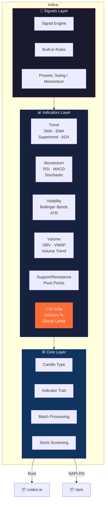
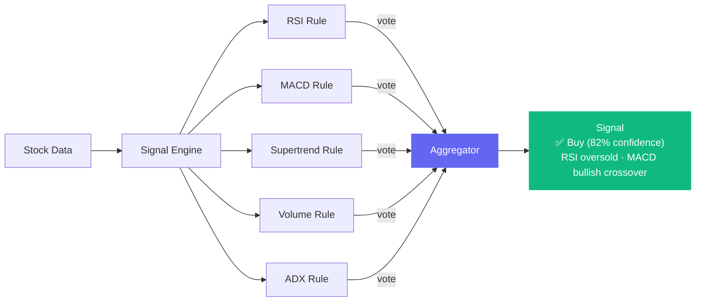

# indica 🔬

**Fast technical analysis indicators for stock markets. Built in Rust. Built for India.**

[](https://www.npmjs.com/package/@devanshhq/indica)
[](LICENSE)
[](https://github.com/Devansh-365/indica/actions)
[]()

---

### Why indica?

| | JavaScript (typical) | Python (pandas-ta) | **indica (Rust)** |
|---|---|---|---|
| 2,000 stocks × all indicators | ~8,000ms | ~3,000ms | **6ms** |
| Streaming (per tick) | Not supported | Not supported | **O(1)** |
| India-specific indicators | None | None | **Delivery %, Circuit Limits** |
| Signal generation | None | None | **Buy/Sell with confidence** |

---

## Architecture



## Indicators (16)

```
┌─────────────────┬──────────────────────────────────────────────┐
│ Trend           │ SMA · EMA · Supertrend · ADX                 │
├─────────────────┼──────────────────────────────────────────────┤
│ Momentum        │ RSI · MACD (+ crossover) · Stochastic %K/%D  │
├─────────────────┼──────────────────────────────────────────────┤
│ Volatility      │ Bollinger Bands (+ %B) · ATR                 │
├─────────────────┼──────────────────────────────────────────────┤
│ Volume          │ OBV · VWAP · Volume Trend                    │
├─────────────────┼──────────────────────────────────────────────┤
│ Levels          │ Classic Pivot Points (R3 → S3)               │
├─────────────────┼──────────────────────────────────────────────┤
│ 🇮🇳 India Only  │ Delivery % Analysis · Circuit Limit Proximity │
└─────────────────┴──────────────────────────────────────────────┘
```

## Install

```bash
# Rust
cargo add indica

# Node.js
npm install @devanshhq/indica
```

## Quick Start

```rust
use indica::*;

let closes = vec![44.34, 44.09, 44.15, 43.61, 44.33, 44.83, 45.10,
                  45.42, 45.84, 46.08, 45.89, 46.03, 45.61, 46.28,
                  46.28, 46.00, 46.03, 46.41, 46.22, 46.21];

// One-liner indicators
sma(&closes, 20);                              // Some(45.52)
rsi(&closes, 14);                              // Some(55.37)
macd(&closes, 12, 26, 9);                      // Some(MacdResult { crossover: Bullish })
bollinger_bands(&closes, 20, 2.0);             // Some(BollingerBandsResult { %B: 0.73 })
stochastic(&highs, &lows, &closes, 14, 3);    // Some(StochasticResult { k: 78.2, d: 65.1 })
supertrend(&highs, &lows, &closes, 10, 3.0);  // Some(SupertrendResult { direction: Up })
adx(&highs, &lows, &closes, 14);              // Some(42.5)
vwap(&highs, &lows, &closes, &volumes);        // Some(245.67)
obv(&closes, &volumes);                        // Some(1_234_567.0)
```

## Streaming API — O(1) Real-Time Updates

Feed candles one at a time. No recomputation. Constant time per tick.

```rust
use indica::{Rsi, Sma, Supertrend, Candle, Indicator};

let mut rsi = Rsi::new(14);
let mut sma = Sma::new(20);
let mut st  = Supertrend::new(10, 3.0);

// Simulates a live data feed
for candle in live_feed {
    if let Some(val) = rsi.update(&candle) {
        println!("RSI: {:.1}", val);
    }
    if let Some(val) = sma.update(&candle) {
        println!("SMA: {:.2}", val);
    }
    if let Some(res) = st.update(&candle) {
        println!("Supertrend: {} ({})", res.value, res.direction);
    }
}
```

Streaming indicators: `Sma` · `Ema` · `Rsi` · `Supertrend` · `Adx`

## Signal Engine — From Numbers to Decisions



```rust
use indica::signals::presets::swing_trader;

let engine = swing_trader();
let signal = engine.evaluate(&indicator_values);

// Signal {
//   strength: StrongBuy,
//   confidence: 0.82,
//   reasons: ["RSI 28.5 — oversold", "MACD bullish crossover", "Volume surging"]
// }
```

Built-in presets: `swing_trader()` · `momentum_trader()`

## Batch Screening — 2,000 Stocks in 6ms

```rust
use indica::batch::{batch_compute_parallel, StockData};

let stocks: Vec<StockData> = load_all_nse_stocks(); // 2,000+

// Compute ALL indicators for ALL stocks using all CPU cores
let snapshots = batch_compute_parallel(&stocks);
// ⏱️ ~6ms on release build
```

### Filter with screening:

```rust
use indica::batch::screen::{screen, ScreenFilter};

let oversold_uptrend = screen(&stocks, &[
    ScreenFilter::RsiBelow(30.0),
    ScreenFilter::SupertrendUp,
    ScreenFilter::AdxAbove(25.0),
]);
// Returns only stocks matching ALL filters
```

## India-Specific Indicators 🇮🇳

Indicators that **only work with Indian market data** — no other TA library has these.

```rust
use indica::{delivery_pct, delivery_trend, circuit_proximity, CircuitLimit};

// ── Delivery Volume Analysis ──
// NSE/BSE publish delivery vs traded volume (unique to India)
let pct = delivery_pct(500_000.0, 1_000_000.0); // 50.0%

let trend = delivery_trend(&delivery_pcts, &closes, 3, 10);
// Some(DeliveryTrend::StrongAccumulation)
// High delivery % + price up = real buying, not speculation

// ── Circuit Limit Proximity ──
// Indian stocks have daily price limits (2/5/10/20%)
let status = circuit_proximity(108.0, 100.0, CircuitLimit::Percent10);
// CircuitStatus {
//   upper_limit: 110.0,
//   lower_limit: 90.0,
//   near_upper: false,
//   upper_distance_pct: 1.82
// }
```

## API Reference

<details>
<summary><strong>Convenience Functions</strong> (click to expand)</summary>

| Function | Returns |
|----------|---------|
| `sma(closes, period)` | `Option<f64>` |
| `ema(closes, period)` | `Option<f64>` |
| `rsi(closes, period)` | `Option<f64>` |
| `macd(closes, fast, slow, signal)` | `Option<MacdResult>` |
| `stochastic(highs, lows, closes, k, d)` | `Option<StochasticResult>` |
| `bollinger_bands(closes, period, mult)` | `Option<BollingerBandsResult>` |
| `atr(highs, lows, closes, period)` | `Option<f64>` |
| `supertrend(highs, lows, closes, period, mult)` | `Option<SupertrendResult>` |
| `adx(highs, lows, closes, period)` | `Option<f64>` |
| `obv(closes, volumes)` | `Option<f64>` |
| `vwap(highs, lows, closes, volumes)` | `Option<f64>` |
| `volume_trend(volumes)` | `&str` |
| `pivot_points(high, low, close)` | `PivotPointsResult` |
| `delivery_pct(delivery_vol, total_vol)` | `f64` |
| `delivery_trend(pcts, closes, short, long)` | `Option<DeliveryTrend>` |
| `circuit_proximity(price, prev_close, limit)` | `CircuitStatus` |

All functions return `Option` when data is insufficient. No panics, no NaN.

</details>

## Project Structure

```
src/
├── core/                    # Candle, Indicator trait, math utils
├── indicators/
│   ├── trend/               # SMA, EMA, Supertrend, ADX
│   ├── momentum/            # RSI, MACD, Stochastic
│   ├── volatility/          # Bollinger Bands, ATR
│   ├── volume/              # OBV, VWAP, Volume Trend
│   ├── support_resistance/  # Pivot Points
│   └── india/               # Delivery Analysis, Circuit Limits
├── signals/                 # Signal engine, rules, presets
├── batch/                   # Parallel batch + screening
└── lib.rs                   # Public API re-exports
```

## Contributing

PRs welcome. Before submitting:

```bash
cargo test
cargo clippy -- -D warnings
cargo fmt --check
```

## License

MIT — [Devansh Tiwari](https://github.com/Devansh-365)
